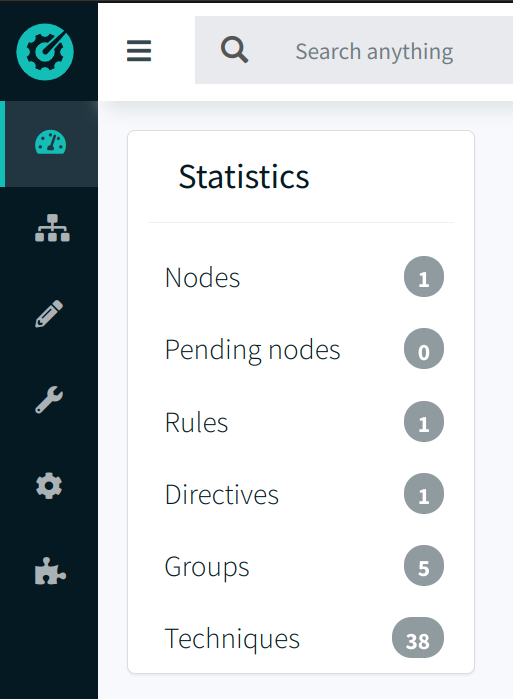
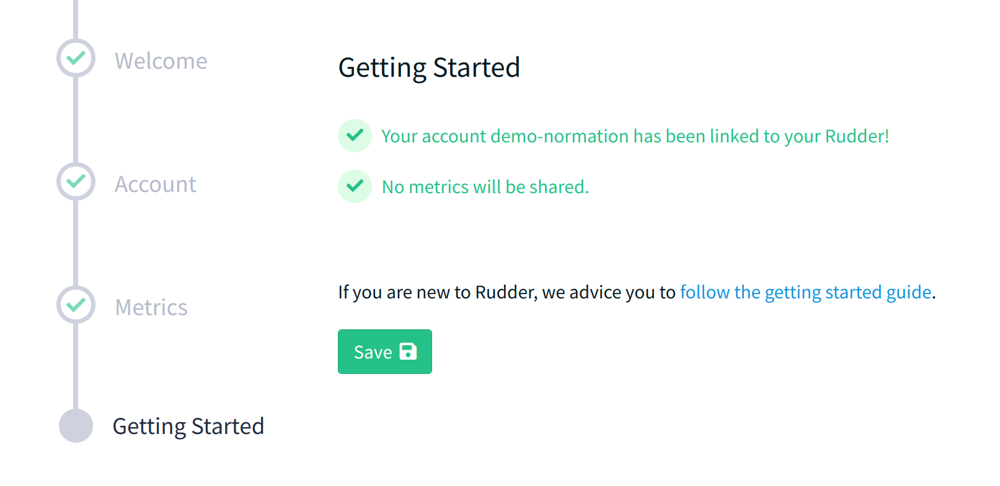
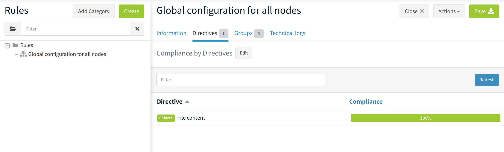
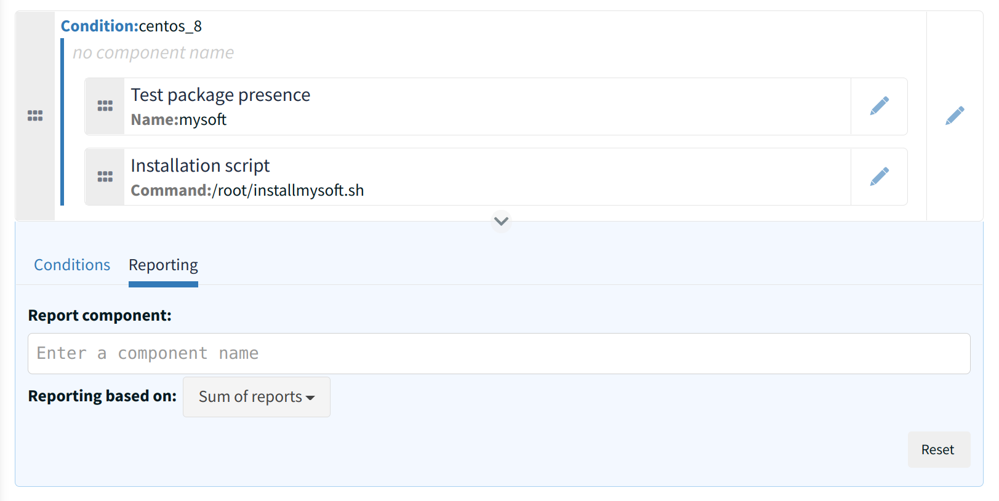
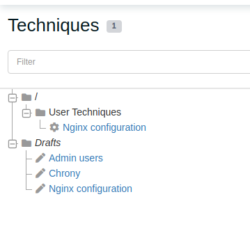
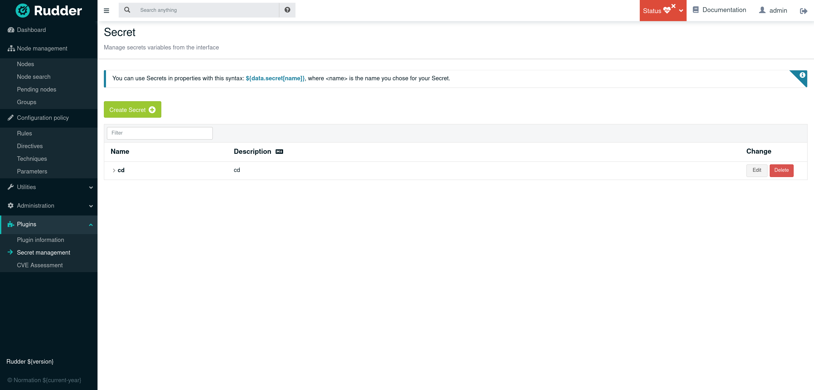
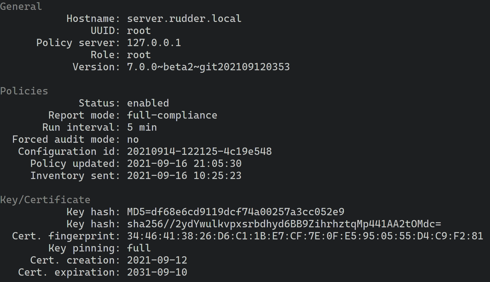
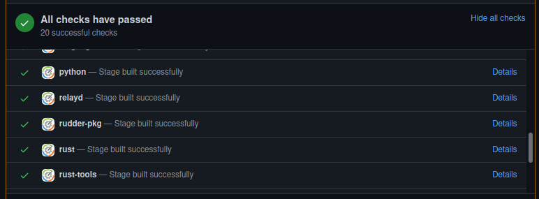

= Rudder 7.0 release notes

Rudder 7.0 is currently a maintained version.

Rudder 7 will be supported for at least three months after next major release,
and for 18 to 24 months with a subscription.

Its main features are :

* A redesigned technique editor, more flexible, especially on the
reporting and compliance side.
* A dedicated configuration DSL for Rudder, with a transpiler to compile
it into configuration code for our supported agents.
* A new visual identity, including a new logo and new colors.

As a major release, 7.0 also comes with improvements in Rudder core
architecture, to improve reliability and performance and prepare the
ground for future exiting features.

== New visual identity

Rudder 7.0 adopts our new visual identify. New colors and a new logo
refreshing the previous design.

== Setup guide on first connection

On first connection, the first admin user will now be guided by a setup
wizard, allowing to configure the Rudder account directly.

== New features for policy configuration

=== Dedicated configuration DSL for Rudder

We now have our own https://docs.rudder.io/language/7.0/[dedicated
configuration DSL]. This gives more flexibility in the way the
configurations are defined, allows to define configurations directly as
code, and easily share techniques.

This language is declarative and focuses on the policies correctness, by
validating as much as possible during policy generation.

This language is compiled (or more precisely transpiled) into configuration code by a new `rudderc`
program written in Rust.

We will give more details in a dedicated blog post soon.

[source,bash]
----
Configure_NTP state technique() {
  package("ntp").absent("","","")
  package("chrony").present("latest","","") as package_present_chrony
}
----

=== Redesigned rules page

The rules page has been rewritten, following our new UI scheme
(initiated with the groups page). Is is now based on a tree on the left
and a visualization and edition zone with tabs on the right, which will
avoid a lot of scrolling compared to the previous layout, and will
present information in a more structured manner.

=== Reproducible and versioned policies

This part is a first step, the ultimate goal being to make the
configuration policies fully reproducible (like in _reproducible
builds_), i.e. to be able to explore and/or apply the configuration of
any point in the past. This requires archiving the full history of
inventory, properties, etc.

We also want to be able to mix different versions of the same item
(e.g. of one directive), to allow progressive deployments of changes.

The 7.0 release contains:

* New APIs exposing historization of techniques and directives. This
means a full history of the item’s revisions.
* An API to link a rule to a previous version of a directive
* An API to link a specific version of a technique to a rule
* Full inventory historization to allow tracking changes in the context.

=== Group methods in the technique editor

Techniques can now contain blocks which are groups of methods with a
common condition, and the ability to configure compliance computing
logic. Blocks can even be nested, and drag-and-drop works as usual.

It is possible to use one of three variants for compliance computation:

* *Sum of reports*: previous behavior, use reports from all methods and
compute the compliance proportionally
* *Worst report*: take the worst outcome of the block as compliance for
the whole block. This case has to sub-cases for reporting accuracy:
** Count the whole block as one report (with the worst outcome) to give
it the weight of a single method
** Give the report the weight of the number of methods in the block (but
still with the worst outcome only)
* *Focus on one method*: Use the outcome of a specific method as outcome
for the block

This allows getting more comprehensive compliance reports, with more
meaningful numbers.

=== *Disable reporting for a method in the editor*

It is now possible to disable reporting for any method, and hence ignore
it in the compliance. This is particularly useful for methods used as
tests, for example if you want to test the present of a package with
_Package present_, and use it as a condition to trigger other actions.
Instead of having to resort to _Condition from command_ for every test,
you can now use any existing method directly.

=== Technique drafts

You can now have multiple technique drafts, give them a name and access
them in the techniques list. This allows switching context without
losing what you were doing.

=== Hide secret values in the interface

We added a new feature allowing to define secret variables, which means
their value will be provided at creation, but not re-displayed in the
interface afterwards. This allows preventing the involuntary display of
passwords in Rudder interface.

== New system integration features

=== Easy setup of external PostgreSQL database

The _server roles_ have been removed in favor of a simpler mechanism
based on settings in the application configuration file. It is now easy
to use an external PostgreSQL database with a Rudder server.

=== Prometheus endpoint in relayd

relayd, the component handling agent-server communication, now has a
https://docs.rudder.io/api/relay/v/1/#operation/getMetrics[prometheus]
endpoint, including:

* information about handled reports and inventories
* information about reports parsing and insertion timings
* information about the relayd process itself

[source,bash]
----
# HELP rudder_relayd_inventories_total Agent inventories
# TYPE rudder_relayd_inventories_total counter
rudder_relayd_inventories_total{status="forward_error"} 1
rudder_relayd_inventories_total{status="forward_ok"} 23
# HELP rudder_relayd_managed_nodes_total Managed Nodes
# TYPE rudder_relayd_managed_nodes_total gauge
rudder_relayd_managed_nodes_total 54
# HELP rudder_relayd_reports_processing_duration_seconds Reports processing
# TYPE rudder_relayd_reports_processing_duration_seconds histogram
rudder_relayd_reports_processing_duration_seconds_bucket{le="0.005"} 1804
rudder_relayd_reports_processing_duration_seconds_bucket{le="0.01"} 1688
rudder_relayd_reports_processing_duration_seconds_bucket{le="0.025"} 1926
[...]
----

This is a first step, and more observability tooling will continue to
get added in next versions.

=== Augeas for advanced configuration file editions

Augeas is a framework providing a tree-like view of a lot of different
configuration file formats (through syntax definitions called
``lenses''). This unified interface allows hassle-free advanced
editions. Augeas is now embedded with the agent when not available as a
system dependency.

=== Configurable ports for agent-server communication

The ports used for both communication channels (by default 443 and 5309)
are now fully configurable. This will make setups in constrained
environments easier. It is now also easy to use different ports and
certificates for public HTTP used for Web and public API access and
agent-server internal communications.

=== Improvements in agent-server communication security

We now have a consistent homogeneous security mechanism across both
communication channels, with the removal of syslog communication and the
automatic setup of HTTPS certificate verification. We use _Trust On
First Use_ by default, but you can pin server keys at node provisioning
too.

=== *AlmaLinux, Rocky Linux and Oracle Linux officially supported*

With the move of Red Hat to CentOS Stream (and the end of life of CentOS
8) for the end of the year, other alternatives have emerged or gained
popularity. As a consequence, we now have full support (including relay
and server) for AlmaLinux, Rocky Linux and Oracle Linux.

=== *Rudder server OS compatibility update*

We added server support for Debian 11 (agent support was added in 6.2)
and dropped SLES 12, RHEL/CentOS 7 and Debian 9, following our usual
maintenance policy.

== Under the hood

These items will are directly visible from the users, but help us keep
Rudder reliable and extensible.

=== Improved agent CLI

The agent comes with a more readable `rudder agent info` output.

=== Configure script for the agent

We added a configure script for the agent build. This makes it more
flexible (compared to our previous static Makefile) and adding support
for new platforms becomes a lot easier.

We also improved our C hardening flags on modern compilers with
`fstack-protector-strong` and `D_FORTIFY_SOURCE=2` when possible, in
addition to existing _full relro_ and _pie_.

=== Frontend continues to transition to Elm

Elm has been our language of choice for frontend work for its great
reliability and maintainability for a few years, and the transition is
continuing with the technique editor rewrite (from AngularJS) and the
new rules page.

=== rudder-relayd updated to tokio 1.0

rudder-relayd, the component handling communications with agents on
server and relays is written in Rust and more precisely based on
https://tokio.rs/[tokio], a fast and reliable asynchronous runtime. It
has been migrated from tokio 0.1 to the 1.0 version, which comes with
the (not so) Rust async/await syntax. It provides better development
experience, better performance (with a new scheduler), and long-term
maintenance of the library for 5 years minimum.

=== More efficient compliance computations

Compliance computations and display has been made more efficient, by
using caches for both computed compliance and expected reports. It
lowers the number of expensive database queries, and makes compliance
computations much faster.

relayd also now handles more steps of reports handling, which is
possible thanks to the syslog reporting removal. This lowers the load on
the webapp and database and makes the whole process more efficient.

=== Improved Continuous Integration

Our code tests, which all run on our Jenkins server also responsible for
building our packages, were migrated from manually configured jobs to
`Jenkinsfile` code (for example in the main
https://github.com/Normation/rudder/blob/master/Jenkinsfile[rudder]
repository). This allows defining the tests along with the code, and
eases jobs maintenance across branches.

Tests are now all run automatically on every pull requests (except for
heavy multi-platform tests which only run daily on maintained branches).

In addition we improved our test suite in most repositories, with
linters for various ecosystems (shellcheck, pylint, etc.), and added
automated checks for known vulnerabilities in our dependencies across
various ecosystems. Most tests now run in Docker containers defined by
Dockerfiles in the repositories, allowing for more consistent and
reproducible test environments.

=== Refactored server system techniques

Server system techniques are the part of system techniques that handle
configuration and management of the server components (webapp, relayd,
ldap server, etc.). We did a major refactoring of these techniques,
which have been split in separate techniques for each configured
service, for improved reliability and maintainability.

=== Dependencies upgrades

As usual in our major releases, most dependencies have been upgraded. In
particular, we now require PostgreSQL ≥10 for Rudder servers.

== Installing, upgrading and testing

* Install docs for https://docs.rudder.io/reference/7.0/installation/server/debian.html[Debian/Ubuntu],
https://docs.rudder.io/reference/7.0/installation/server/rhel.html[RHEL/centOS] and 
https://docs.rudder.io/reference/7.0/installation/server/sles.html[SLES]
* https://docs.rudder.io/reference/7.0/installation/upgrade/notes.html[Upgrade nodes and doc]
* https://docs.rudder.io/reference/7.0/installation/versions.html#_versions[Download links]

== Supported operating systems

This version provides packages for these operating systems:

* Rudder server and Rudder relay: *Debian 10-11, RHEL/CentOS/Alma/Rocky 8,
SLES 15, Ubuntu 18.04 LTS and 20.04 LTS*
* Rudder agent: all of the above plus *Debian 9, RHEL/CentOS 7, SLES_12*
* Rudder agent (binary packages available with a https://www.rudder.io/en/pricing/subscription/[subscription]) : *Debian 5-8, RHEL/CentOS 3-6,
SLES 10-11, Ubuntu 10.04 LTS-12.04 13.04-15.10 LTS-14.04 LTS-16.04, Windows Server 2008R2-2019, AIX
5-6-7, Solaris 10 & 11, Slackware 14*

Read more about supported operating systems 
https://docs.rudder.io/reference/7.0/installation/operating_systems.html[in the documentation].

