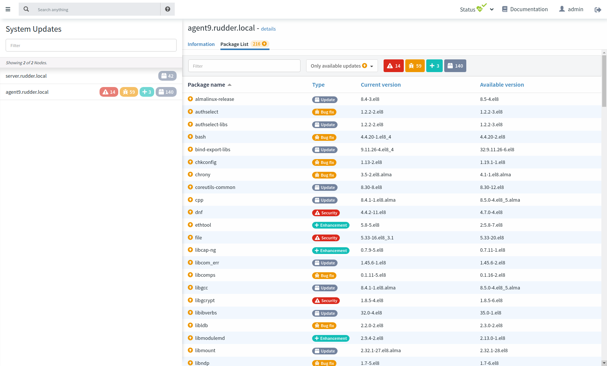
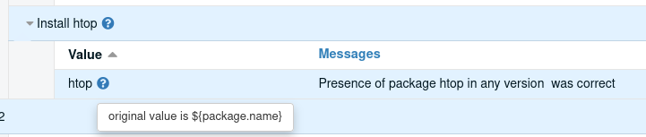
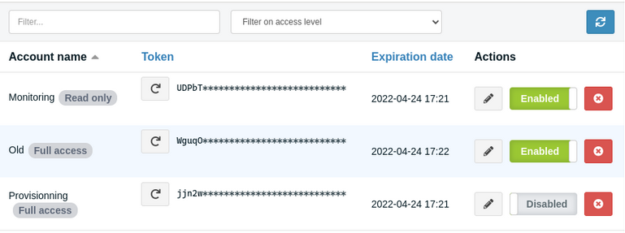

= Rudder 7.1 release notes

Rudder 7.1 is currently a maintained version.

Rudder 7 will be supported for at least three months after next major release,
and for 18 to 24 months with a subscription.

Its main focus is a first release of a new patch management feature.

== What's new?

=== A new patch management feature

The list of currently available updates is now available as part of the inventory on most Linux systems
(those using `apt`, `yum/dnf` or `zypper`).

It is exposed in the API and the Web interface, both in node details and in a new dedicated view (as part of the subscription),
exposing additional information like update severity, description etc. when available.

Rudder 7.1 also comes with built-in techniques for full system update on Linux and Windows, allowing to schedule
full system update campaigns. This feature will be improved in the following versions, with a dedicated interface.

=== Thematically organized menu

The _Plugins_ sections disappears, and the plugins are now integrated into relevant categories.

=== Improved precision and reliability of reporting

We reworked the reporting engine to make reports easier to match to the policies part which produce
them. This has been done by introducing a new unique identifier for each component. This allows:

* To use variables in the component name of the methods. It does not have to be known at generation time anymore.
  The original value is still displayable in the compliance interface.

* More precise reporting, solving some old intricate technical limitations.

This is completely transparent for the users.

The unique identifier has also been used to improve the agent-side reporting process, which has been
refactored to be simpler, more reliable and to allow any re-execution of similar or identical methods.
For now the following methods have been ported to the now report process:

* service
* package
* commands

Others will follow in upcoming versions.

=== A new method to trigger an inventory

A new method has been added, allowing to trigger an inventory at the next agent run.
This allows updating the server side inventory more quickly after a change that impacts the inventory
content (like package management, system upgrade, network changes, etc.)

=== Compatibility of service methods with other systemd unit type

The service methods can now be used with other systemd unit type by adding the extension
(just like you would do on the CLI), like `dnf-makecache.timer` or `tmp.mount`.

This makes it easier to apply states on these units.

=== Support for authenticating users through OpenID Connect

It is now possible, besides existing LDAP/AD authentication, to used OpenID Connect, enabling two factor
authentication mechanisms and integration to your existing authentication providers.

=== API account page has been rewritten

Using our new design and tooling, we redesigned the page allowing the manage the API accounts.
Apart from the visual improvements, it also improves the user experience with configuration
popup for destructive actions (removal or replacement of a token) and hidden token with a button
to copy the value, to avoid unwanted leak through screen sharing for example.

=== Performance improvements in vulnerability management

Several improvements were made to vulnerability management, especially on the memory usage.

== Installing, upgrading and testing

* Install docs for https://docs.rudder.io/reference/7.1/installation/server/debian.html[Debian/Ubuntu],
https://docs.rudder.io/reference/7.1/installation/server/rhel.html[RHEL/CentOS] and
https://docs.rudder.io/reference/7.1/installation/server/sles.html[SLES]
* https://docs.rudder.io/reference/7.1/installation/upgrade/notes.html[Upgrade nodes and doc]
* https://docs.rudder.io/reference/7.1/installation/versions.html#_versions[Download links]

== Supported operating systems

This version provides packages for these operating systems:

* Rudder server and Rudder relay: *Debian 10-11, RHEL/CentOS/Alma/Rocky 8,
SLES 15, Ubuntu 18.04 LTS and 20.04 LTS*
* Rudder agent: all of the above plus *Debian 9, RHEL/CentOS 7, SLES 12*
* Rudder agent (binary packages available with a https://www.rudder.io/en/pricing/subscription/[subscription]) : *Debian 5-8, RHEL/CentOS 3-6,
SLES 10-11, Ubuntu 10.04 LTS-12.04 13.04-15.10 LTS-14.04 LTS-16.04, Windows Server 2008R2-2019, AIX
5-6-7, Solaris 10 & 11, Slackware 14*

Read more about supported operating systems 
https://docs.rudder.io/reference/7.1/installation/operating_systems.html[in the documentation].

