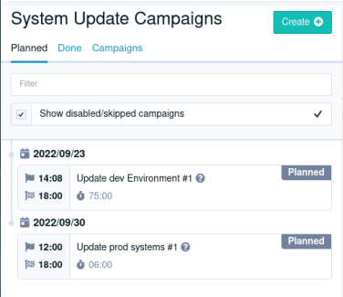
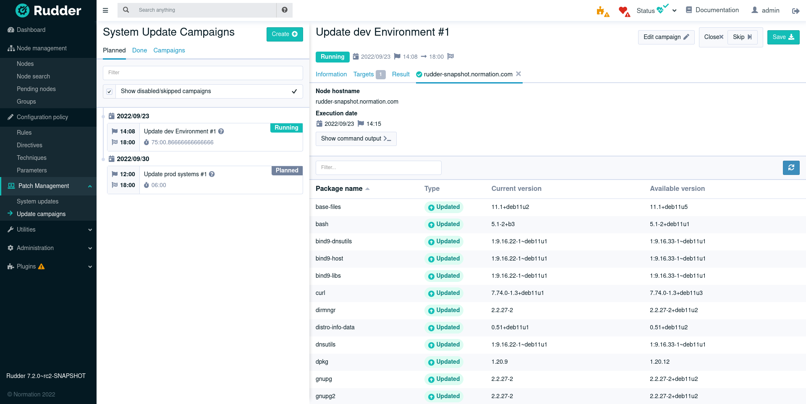
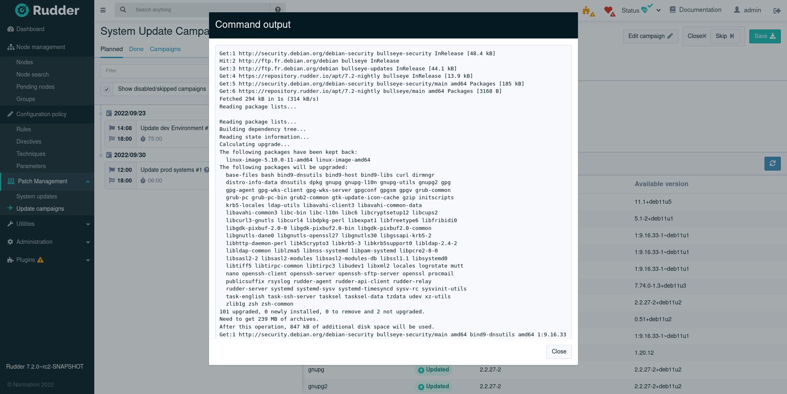

= Rudder 7.2 release notes

Rudder 7.2 is currently a maintained version.

Rudder 7 will be supported for at least three months after the next major release,
and for 18 to 24 months with a subscription.

== New patch management features

=== Patch management campaigns

The patch management feature gains the ability to schedule upgrade campaigns across your nodes.

You can define either one-shot or recurring (weekly or monthly) campaigns, targeting a set of groups.
You also define a time windows, and the upgrades will automatically be spread across the target nodes.

Once the upgrade has run, you get a centralized view over the results.

And you can also access detailed logs to troubleshoot any issue.

=== Windows updates

* Available system updates (through Windows Update) are now listed on Windows nodes too, both in node details and centralised system update view.
* The Windows system update technique is now able to download its upgrades from a _Windows Server Update Services_ (_WSUS_) server.

== Configuration policies

=== Import-export of configuration

It is now possible to https://docs.rudder.io/api/v/16/#tag/Archives[export to and import from] another server a rule or directive and all of its
dependencies (including techniques from the technique editor).

This allows finer-grained synchronization compared to git repository synchronization.

=== Improved reporting when using "iterator" variables

Reporting will now be correct when using iterator variables as input for methods (for example
when using an iterator variable to install several packages).

== Agents

=== Terminology clarification for agent types

We renamed the agent types to make them clearer for users:

* `Classic` is now `Linux` (but also covers AIX)
* `DSC` is now `Windows`

=== The API allowing to pre-create nodes is now part of the base API

The plugin "create-node" allowed pre-creating nodes in Rudder. This means making the node
visible in the interface, and being able to pre-provision settings (certificate, node properties, etc.)
before the node actually sent its first inventory.
This is useful in a provisioning automation context.

This feature is https://docs.rudder.io/api/v/16/#tag/Nodes/operation/createNodes[now part of the base HTTP API].

=== RHEL 9 support (and all its siblings!)

We added support both as server and agent for RHEL 9 and derivatives (CentOS Stream, Rocky Linux,
AlmaLinux, Oracle Linux).

=== Improvements for our Windows agent

==== New execution engine

Our Windows agent improved with a new execution engine (written in F#), unlocking a lot of
current and future improvements.

==== Improved experience for Powershell script execution

It is now easier to handle errors when running Powershell scripts from the agent.

== Administration

=== It is now possible to configure user logins to be case-insensitive

This allows matching the behavior of authentication sources (en particularly _Active Directory_).

=== Ability to define configuration override in a rudder-web.properties.d directory

It is not a lot easier to make changes to the Rudder server configuration by deploying them as overrides
over the default configuration in the `rudder-web.properties.d` (with a the `.conf` extension).

=== New page to list information about server hooks

We added a page in the settings section to show the list of currently configured server hooks.

=== Packages

* We merged and renamed packages to make their content more obvious:
	** `rudder-webapp`, `rudder-server-root` and `rudder-reports` are merged into `rudder-server`
	** `rudder server-relay` becomes `rudder-relay`
	** `rudder-agent` stays `rudder-agent`

* `cron` is not used anymore on relays, avoiding installing it on minimal system installs

=== Improved external database setup

== Miscellaneous

=== Improved vulnerability tracking

Notable performance improvements were made to the vulnerability tracking feature.

=== The dashboard style has been refreshed

A small cosmetic update was made on the dashboard to better match the new style.

== Installing, upgrading and testing

* Install docs for https://docs.rudder.io/reference/7.2/installation/server/debian.html[Debian/Ubuntu],
https://docs.rudder.io/reference/7.2/installation/server/rhel.html[RHEL/CentOS] and
https://docs.rudder.io/reference/7.2/installation/server/sles.html[SLES]
* https://docs.rudder.io/reference/7.2/installation/upgrade/notes.html[Upgrade nodes and doc]
* https://docs.rudder.io/reference/7.2/installation/versions.html#_versions[Download links]

== Supported operating systems

This version provides packages for these operating systems:

* Rudder server and Rudder relay: *Debian 10-11, RHEL/CentOS/Alma/Rocky 8 and 9,
SLES 15, Ubuntu 20.04 LTS and 22.04 LTS*
* Rudder agent: all of the above plus *Debian 9, RHEL/CentOS 7, SLES 12*
* Rudder agent (binary packages available with a https://www.rudder.io/en/pricing/subscription/[subscription]) : *Debian 5-8, RHEL/CentOS 3-6,
SLES 10-11, Ubuntu 10.04 LTS, 12.04 LTS, 13.04, 15.10, 14.04 LTS, 16.04 LTS, 18.04 LTS, Windows Server 2008R2-2019, AIX
5-6-7, Solaris 10 & 11, Slackware 14*

Read more about supported operating systems 
https://docs.rudder.io/reference/7.2/installation/operating_systems.html[in the documentation].

