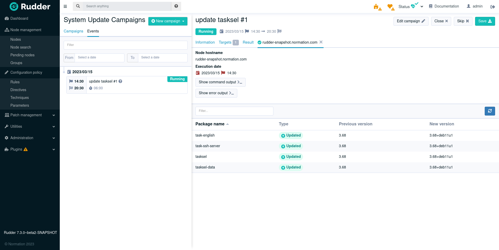
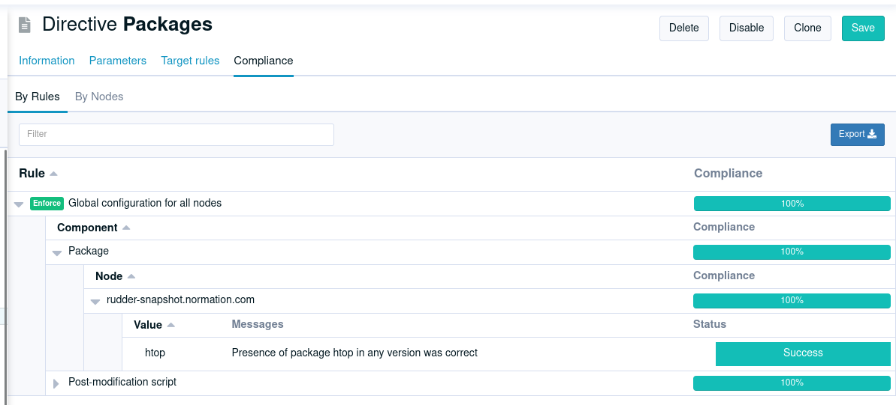

= Rudder 7.3 release notes

We're thrilled to announce the availability of Rudder 7.3.
This version deepens the patch management on Windows
and brings targeted update campaigns to update more accurately your systems.
Automate your patch management through the new dedicated API.
Also, compliance exploration is greatly improved on the directives, and we enhanced our user permissions.

The 7.3 version is the last of the 7.X branch, the next one will be Rudder 8.0 scheduled for 2023Q4.
It will be supported:

* For users with a subscription, depending on chosen the service level:

  ** For either 6 or 9 months after 8.0 release
  ** Regardless or the 8.0 release date, for either 18 or 24 months after the initial 7.0 release (2022-01-26)

* For users without a subscription, for 3 months after 8.0 release

== Patch management

=== Targeted update campaigns

Besides full system upgrade, it is now possible for an update campaign to target a specific set of packages (by specifying package names, and optionally target versions).
It is specially useful for critical security updates that often need to be deployed outside the normal process.

=== Reboot/restart when needed

Upgrading the packages is an important part of patch management,
but making sure the patched version is actually used is essential.
To address this, the post-update action in the campaign can now be one of:

* **Always reboot** (useful to ensure a regular, e.g. monthly, reboot as part of the upgrade process)
* **Reboot or restart services as needed**, depending on the upgraded packages.

  ** on Windows, it will reboot the system if needed
  ** on Linux, it will either restart the affected services or reboot the system depending on what is required to apply the upgrades.

* **Restart as needed**

  ** on Windows, it does nothing.
  ** on Linux, it will either restart the affected services if needed, but not reboot the system.

* **Don't do anything** and let the user take the required actions.

The list of services to restart or the need to reboot come from the system
and/or package manager depending on the target platform.

=== Windows support

The patch campaigns introduced for Linux in 7.2 are now fully usable on Windows too. Plan system updates in advance, either as a one-shot or recurring event, and visualize the results directly in the interface
(list of installed KB, details in case of error, etc.).

A single update campaign can include heterogeneous systems (different Windows versions and Linux distribution,
for example).

=== Mixed systems campaigns

A single update campaign can now include heterogeneous systems (different Windows versions and Linux distribution,
for example).
Manage your update campaigns from a single source, regardless of your systems.
You benefit from a main interface and centralize patch reports.

=== APIs for update campaigns

Our REST API now covers the update campaigns, so you can automate campaign definition and maintenance.
Read the https://docs.rudder.io/api/v/17/#TODO[API documentation] for more details.

== MSI package for the Windows agent

The previous `.exe`-based installer is replaced by an MSI (_Microsoft Software Installer_) file. This makes it easier to deploy, especially in enterprise contexts.

== Compliance displayed by directive

We added a new tab in directive view to display the compliance of a directive, showing all rules/nodes applying it. As usual, it comes with an https://docs.rudder.io/api/v/17/#tag/Compliance/operation/getDirectivesCompliance[API], and this one can also be downloaded as a CSV (for spreadsheet fans).

== Vulnerability management refinements

The HTTP API of the vulnerability management feature has been improved with new
filters (by score, publication date, affected package name, etc.) and an API to get a CVE details.
To use it, follow our https://docs.rudder.io/api/v/17/#tag/CVE[API documentation].

== Permissions

=== Fine-grained permissions for features based on plugins

The permissions system has been extended to allow fine rights on features provided as plugins (system updates, CVE management, etc).

These new permissions can be used like the classic ones, by adding items like `cve_read` to your
user roles to give them read access to the CVE page and API.

=== Custom user roles

Define new roles, in addition to built-in roles (e.g. `admin`, `read_only`), to improve the readability of your
user permissions configuration. They live in a new section of the `rudder-users.xml` file:

[source,xml]
----
<authentication>
  <custom-roles>
    <role name="security_auditor" permissions="cve_read,rule_read,system-update_read" />
  </custom-roles>

  <user name="jane.doe" roles="security_auditor" password="..." />
  <user name="john.doe" roles="security_auditor" password="..." />
</authentication>
----

Read the https://docs.rudder.io/reference/7.3/administration/users.html#_user_and_role_configuration_file[documentation] for details.

== Amazon Linux 2023

Amazon Linux 2023, released on March 15, 2023, is now supported as both an agent and server OS.

== Under the hood

* Our YAML technique format is getting closer to general availability (planned for 8.0), and will become the internal storage format for techniques and a stable exchange format for users. It will allow easily writing complex techniques and sharing them. Stay tuned for more! 🔥
* Security improvements (that we also backported to 7.2.3/7.2.4) for front-end. This includes configurable timeout for Web sessions and various hardening configurations.
* Improvements in the new Windows agent engine introduced in 7.2. A focus was made on the quality of the agent logging and the testability of the different components.
* Improvements in the build process of JS/CSS/Elm sources, using npm and gulp (this could be a first step for introducing a dark theme in a future release of Rudder, but 🤫).
* The backend (written in Scala) was updated to https://zio.dev/[ZIO] 2, and https://github.com/Normation/rudder/pull/4603[preliminary work] for upgrading to Scala 3 started (thanks to folks at https://virtuslab.com[VirtusLab] 🙏). Our Scala code is also now auto-formatted thanks to https://github.com/Normation/rudder/blob/master/webapp/sources/.scalafmt.conf[`scalafmt`].

== Installing, upgrading and testing

* Install docs for https://docs.rudder.io/reference/7.3/installation/server/debian.html[Debian/Ubuntu],
https://docs.rudder.io/reference/7.3/installation/server/rhel.html[RHEL/CentOS] and
https://docs.rudder.io/reference/7.3/installation/server/sles.html[SLES]
* https://docs.rudder.io/reference/7.3/installation/upgrade/notes.html[Upgrade nodes and doc]
* https://docs.rudder.io/reference/7.3/installation/versions.html#_versions[Download links]

== Supported operating systems

This version provides packages for these operating systems:

* Rudder server and Rudder relay: *Debian 10-11, RHEL/CentOS/Alma/Rocky 8 and 9,
SLES 15, Ubuntu 20.04 and 22.04 LTS, Amazon Linux 2023*
* Rudder agent: all of the above plus *Debian 9, RHEL/CentOS 7, SLES 12*
* Rudder agent (binary packages available with a https://www.rudder.io/en/pricing/subscription/[subscription]) : *Debian 5-8, RHEL/CentOS 3-6,
SLES 10-11, Ubuntu 10.04 LTS, 12.04 LTS, 13.04, 15.10, 14.04 LTS, 16.04 LTS, 18.04 LTS, Windows Server 2008R2-2019, AIX
5-6-7, Solaris 10 & 11, Slackware 14*

Read more about supported operating systems
https://docs.rudder.io/reference/7.3/installation/operating_systems.html[in the documentation].

