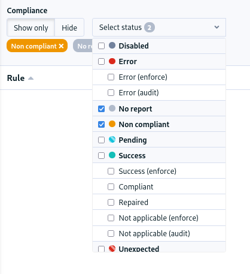
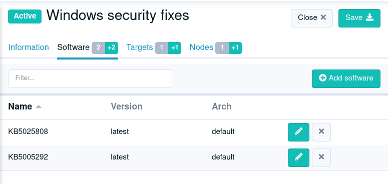
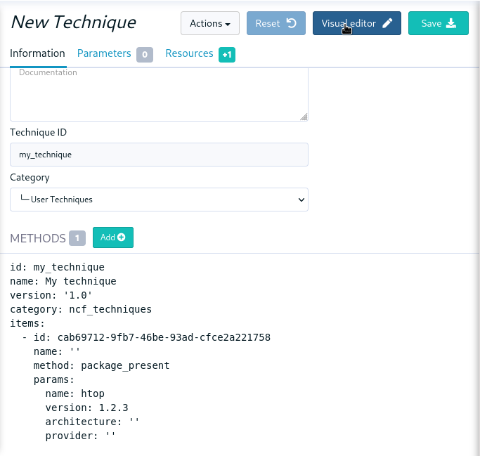
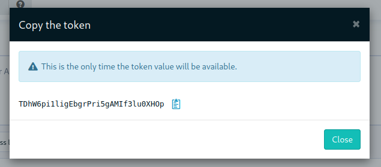
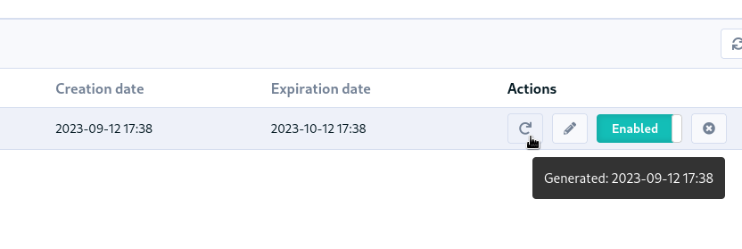
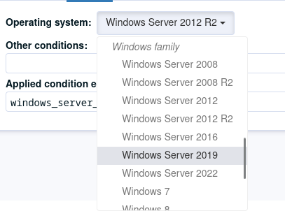
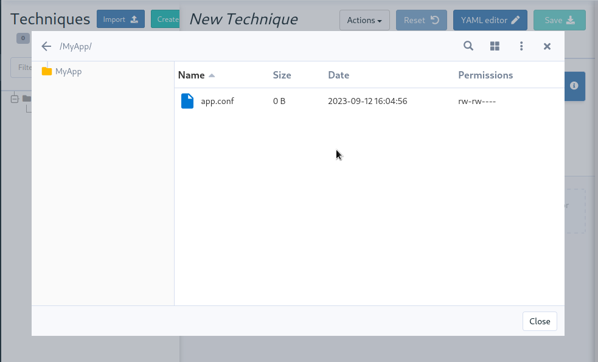
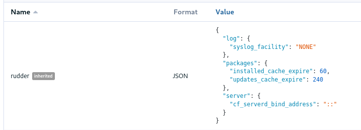

= Rudder 8.0 release notes

[WARN]

====

Rudder 8.0 is still in beta, and *must not* be used in production for now.

====

We’re thrilled to announce the availability of pre-releases of Rudder 8.0.
The 8.X versions will be mainly dedicated to developing the compliance
axis. This will affect different parts of the application, including the server
and the agent, stay tuned for upcoming features!

== ⌨️ Platform support

The 8.0 version is the first of the 8.X branch. As with each major version, the list of supported platforms
evolves.

*Rudder server and relay*: Debian 11 & 12, RHEL/CentOS/Alma/Rocky 8 & 9, SLES 15 SP4+, Ubuntu 22.04 LTS, Amazon Linux 2023

* Added: Debian 12, Amazon Linux 2023
* Removed: Debian 10, Ubuntu 20.04 LTS, SLES 15 SP3 and below, Amazon Linux 2

*Rudder agent*: https://docs.rudder.io/reference/8.0/installation/operating_systems.html#_for_rudder_nodes[see the documentation for details]

* Added: Debian 12
* Now require extended subscription: SLES 11 \<=SP4, SLES 12 \<=SP4, SLES 15 \<=SP2, Windows Server 2008R2, 2012 and 2012R2, Ubuntu 16.04 LTS, Debian 9

== 📊 Compliance filters

The compliance views gain a new long-awaited feature, the ability to filter the content by report type.
You can for example only display the errors, of filter out all successful components in one click.

== 🩹 Patch management features

=== 🎯 Targeted update campaigns on Windows

It is now possible to create update campaigns that focus on a specific set of KBs,
allowing targeted fixes, for example, for critical security updates that need
to be applied immediately.

=== ✅ Pre/post upgrade hooks for campaigns on Linux

Campaigns now include a mechanism to run actions before or after the upgrade.
This covers a variety of needs:

* Run "pre-flight" check: available disk space check, backup check, etc... It allows stopping the update process if the system is not ready.
* Run pre-update actions: take a VM snapshot of the system, etc.
* Run post-update actions: update a CMDB, notify the user, etc.

In order to be flexible, these hooks can actually be any
executable file on the system (shell/Powershell script, Python script, etc.)
Read more about this feature in the https://docs.rudder.io/reference/8.0/plugins/system-updates.html#_hooks[documentation].

== 📗 YAML policies

=== 🖊️ Writing techniques

Rudder includes a graphical editor for techniques, providing easy access creation and customization of configuration policies in Rudder.
In addition to this visual editor, it is possible to create and modify techniques as code, in YAML format, like:

[source,yaml]
----
id: "ntp"
name: "NTP configuration"
version: "0.1"
description: "This technique configures the local ntp service"
documentation: "**Markdown** formatted documentation."
items:
  - name: "NTP configuration"
    method: file_content
    condition: "debian"
    params:
      path: "/etc/ntp.conf"
      lines: "server ntp.org"
      enforce: "true"
----

These two representations are equivalent, and you will be able to switch between both of them to edit the same technique.

The YAML format also becomes the internal storage format for techniques (used in the configuration
git and archives).
This format is stable, so techniques can be shared between Rudder servers having different versions.

=== ⚙️ The `rudderc` toolbox

The new format comes with a matching CLI called `rudderc` (think "Rudder compiler").
It is responsible for compiling the techniques into a lower-level representation
depending on the target platform.

----
$ rudderc build
        Read 179 methods (/path/to/methods/lib)
   Compiling my_technique v0.1 [Linux]
       Wrote target/technique.cf
   Compiling my_technique v0.1 [Windows]
       Wrote target/technique.ps1
  Generating my_technique v0.1 [Metadata]
       Wrote target/metadata.xml
      Copied resources
----

This tool has been designed with local technique development in mind, i.e., directly
on the user environment, without requiring a Rudder server.
It includes powerful static checks, and a simple testing framework that allows
testing techniques without a server, by generating the necessary boilerplate automatically.
This will make integrating techniques in a standard CI/CD GitOps workflow way easier.

Read more about it in the https://docs.rudder.io/techniques/8.0/[dedicated documentation].

== Identity and Access Management

=== 👥 Roles for plugin-based features

The user permissions have been extended to integrate plugin-based features.
New permission (`cve_read`, `cve_write`, etc.) are available and can be added to your exiting roles.
This allows fine-tuning access to the different features.

=== 🔑 Hashed API tokens

All API tokens are now stored hashed with SHA-512.
There are therefore only available at
creation time. This improves the security and traceability of token usage.

For compatibility, existing tokens will still work after upgrade, but we advise to regenerate
or replace them. They will stop working in a future version of Rudder.

The token creation date is also added to the table
(and the latest generation date in a tooltip).

== 🛠️ Under the hood

=== 🪟 System conditions for Windows

Precise system conditions are now available on Windows, allowing to specify different behaviors
in techniques depending on the Windows version (`windows_11`, `windows_server_2022`, etc.).
They are also available as predefined selectors in the technique editor.

=== 🌳 Elm replaces the last AngularJS bits in the frontend

The last pages implemented in AngularJS (1.8, not maintained anymore) were rewritten in https://elm-lang.org/[Elm].
This includes the file manager used for technique resources and shared files, the quick search field, etc.
This enhances security and maintainability.

As a bonus feature, JSON nodes and groups properties now have syntax highlighting.

=== 🔒 TLS 1.3 used for all Rudder communications

We previously required TLS 1.2+, but thanks to the updated set of supported server OSes
(and embedded openssl on old systems), we have switched to enforce https://www.cloudflare.com/learning/ssl/why-use-tls-1.3/:[TLS 1.3].
This greatly limits the risk of misconfiguration and forces the usage of state-of-the art
algorithms.

=== ⬆️ Up-to-date dependencies

We made our usual dependency upgrade round, with OpenSSL 3.0 LTS, Fusion Inventory 2.6, JVM 17+, PostgreSQL 13+, CFEngine 3.21 LTS, etc.

=== ✂️ End of syslog dependency

The old-time dependency on syslog is no more. The Linux agent does not
log its outputs to syslog by default anymore, and `rsyslog` is not a
server dependency anymore.
This avoids duplicating the output and makes the server usable in
minimal setups without a syslog daemon.

=== 📜 The accepted/refused node history is now stored in the database

It was previously on the filesystem (in `/var/rudder/inventories/historical`).
This will be less confusing for users and allow easier management.

=== 🥸 The mustache templating will fail in case of undefined variables (on Linux)

To match the Jinja2 templating behavior, the mustache implementation will also fail
on missing variable. This will avoid producing broken configuration files in
cas of misconfiguration, and make problems stand out.

=== 🔡 A new native font stack

The fonts used in the Web application have been consolidated,
and switched to a modern https://getbootstrap.com/docs/5.0/content/reboot/#native-font-stack[native font stack]
that should better match every device and OS.

== 💾 Installing, upgrading and testing

* Install docs for https://docs.rudder.io/reference/8.0/installation/server/debian.html[Debian/Ubuntu],
https://docs.rudder.io/reference/8.0/installation/server/rhel.html[RHEL/CentOS] and
https://docs.rudder.io/reference/8.0/installation/server/sles.html[SLES]
* https://docs.rudder.io/reference/8.0/installation/upgrade/notes.html[Upgrade nodes and doc]
* https://docs.rudder.io/reference/8.0/installation/versions.html#_versions[Download links]

