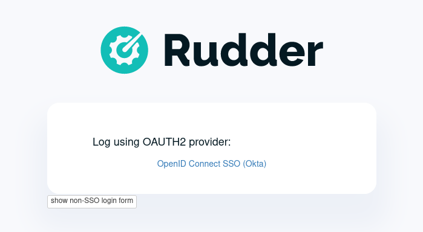

= Rudder 8.1 release notes

We're thrilled to announce the availability of pre-releases of Rudder 8.1.
The 8.X versions is mainly dedicated to developing the compliance
axis. This will affect different parts of the application, including the server
and the agent, stay tuned for upcoming features!

== Compliance

=== 📊 Rudder score

image::images/score.png[]
image::images/score2.png[]

=== Compliance view for groups

The policy compliance view that already existed for nodes, rules and directives has
also been added in the group pages.

You can now explore the 

image::images/group.png[]

We added two visualization modes:

image::images/targeted.png[]

== 📗 Policies

=== Policy mode override by method

image::images/override.png[]

=== Select parameters in the technique editor's techniques

Technique parameters can now be restricted to a limited set of values.

image::images/select1.png[]
image::images/select2.png[]

== Identity and Access Management

=== Multi-tenant

We are introducing a new concept in Rudder, representing
different teams working on the same Rudder server but
operating different sets of nodes.

A Rudder server can be used bu different tenants, which are
defined as a set of users and a set of node groups.

These users will only be able to read information about the nodes affected to the tenant.
For now there it is limited to read-only access.

=== OIDC-based user provisioning

You can now provision your Rudder users directly with an 
OpenID Connect server.

=== 👥 User sessions

We now store all session history for users in the database.
This information will be exposed in the Web interface in an upcoming
version.

== 🛠️ Under the hood

=== New rudder package command

The plugin manager has been rewritten and its command-line interface is now simpler
and more user-friendly.
All commands taking plugin names now accept multiple values.

The new interface is not compatible with the earlier one and the arguments and options
were reworked. For most used commands the changes are:

* `rudder package install-file <file>` -> `rudder package install <file>`
* `rudder package plugin enable/disable <plugin>` -> `rudder package enable/disable <plugin>`
* `rudder package check-connection` -> `rudder package update --check`

You can still use the previous implementation with `RUDDER_PKG_COMPAT=1 rudder package ...`, but it will
be removed in an upcoming release.

image::images/package.png[]

=== 🔒 CSP headers

To continue to strengthen the security of Rudder, we are introducing new
`Content-Security-Policy` HTTP headers for Rudder's interface,
achieving [strict CSP](https://csp.withgoogle.com/docs/strict-csp.html)
leveraging the latest features of the browsers (CSP level 3 and `strict-dynamic`),
for state-of-the-art XSS protection.
This is for now restricted to the _Health check_ page and will be extended in upcoming versions.

=== Python dependency for Linux agents

We added the system Python package as a dependency for our agent,
as it was already required for package management features, and jinja2 templating.

=== ZIO JSON

In the internals of the Web application, as part of our migration
to the ZIO framework, we've rewritten a lot of our JSON/YAML serializers and deserializers using ZIO JSON.

=== Refactoring of our Rust projects

We now have a common cargo workspace for all our projects, enabling 
more consistent dependency management. We also have a common library for
Rudder CLIs written in Rust, providing a consistent terminal UI/UX.

=== SASS preprocessor & Bootstrap 5

We upgraded our main CSS library, bootstrap, to its latest major version.
This required major refactoring as we were on a quite older versions.

=== Syntax Windows

== 💾 Installing, upgrading and testing

* Install docs for https://docs.rudder.io/reference/8.1/installation/server/debian.html[Debian/Ubuntu],
https://docs.rudder.io/reference/8.1/installation/server/rhel.html[RHEL/CentOS] and
https://docs.rudder.io/reference/8.1/installation/server/sles.html[SLES]
* https://docs.rudder.io/reference/8.1/installation/upgrade/notes.html[Upgrade nodes and doc]
* https://docs.rudder.io/reference/8.1/installation/versions.html#_versions[Download links]
