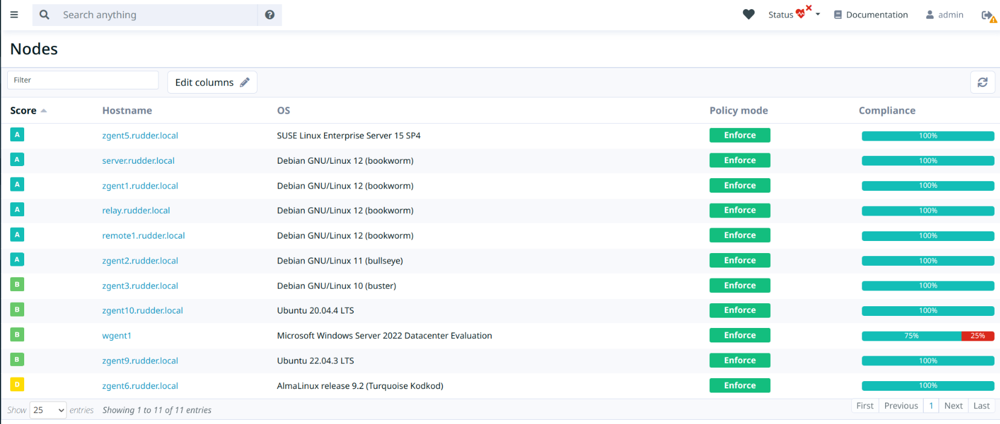
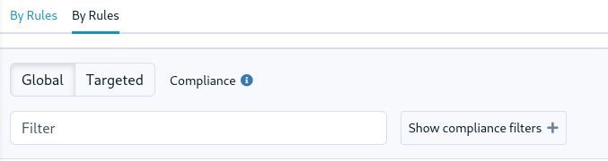
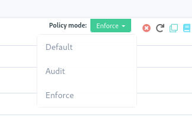
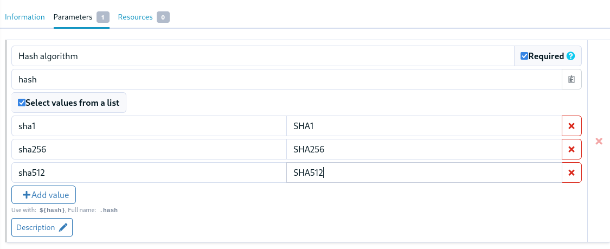
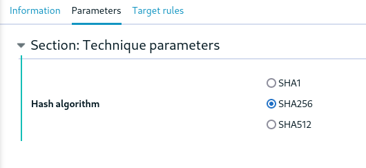
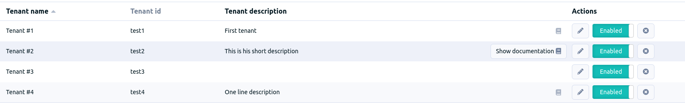
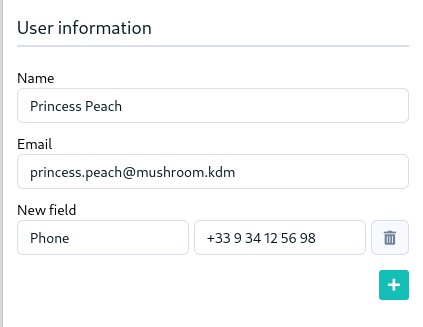
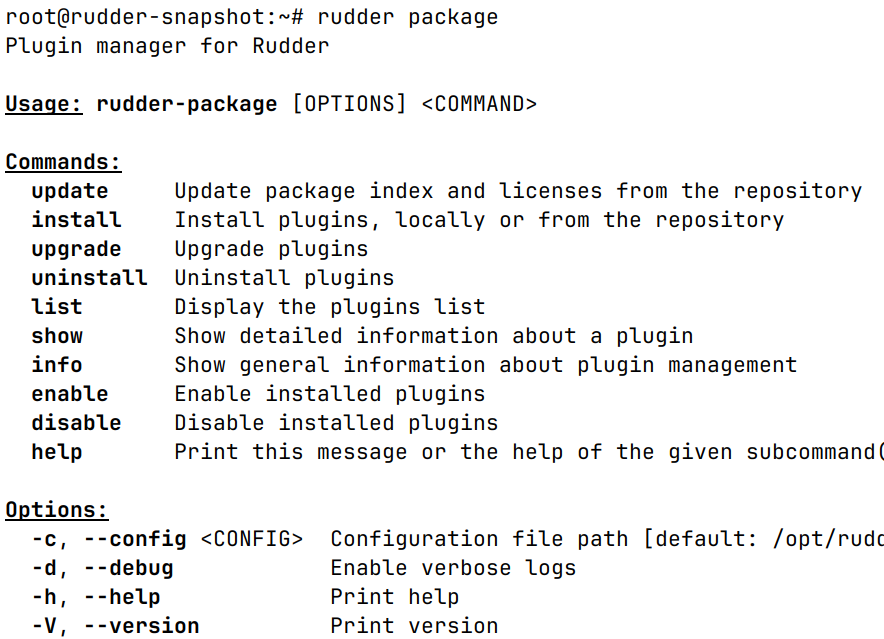

= Rudder 8.1 release notes
:source-highlighter: rouge

We're thrilled to announce the availability of Rudder 8.1.
The 8.X versions are mainly dedicated to developing the compliance
axis, and the first results are now available!

== Compliance

=== 📊 Rudder score

The major addition to the 8.1 release is the Rudder score concept.
Rudder has always had a focus on compliance and strives to provide
excellent visibility to its users on the state of their infrastructure,
thanks to various compliance views, and other dedicated views like available
upgrades or known vulnerabilities.

We're going a step further with the scores, which provide a synthetic overview
of a node status. Various components are aggregated to provide a global score for the node,
reflecting how in line it is with the security and configuration policies on a 360° horizon.
This allows spotting at a glance the systems with the most associated risk and target
remediation more efficiently.

The scores have been added in node details, where the score
is detailed with its sub-scores.
Scores are also visible in the node list for overview, sorting, etc.

image::images/score.png[]

=== Compliance view for groups

The policy compliance view that already existed for nodes, rules and directives has
also been added in the group pages.
You can now explore the detailed compliance at the group level:

image::images/group.png[]

We added two visualization modes:

* Global compliance will show the compliance of all rules that apply directives to a node within this group.
* Targeted compliance will show only the compliance of rules that explicitly include this group in their target.

== 📗 Policies

=== Policy mode override by method

The technique editor and YAML policies now allow overriding the policy
mode at the block or method level.
The policy mode is usually set at the node, directive or global level,
and configures whether the policy should be audited or enforced.
This new feature is different in the way it is designed to operate inside the technique
itself.
It allows two things, lifting a long-time constraint of techniques:

* overriding a policy part to enforce, to make an action necessary for an audit but not modifying the system, for example, running an audit script, creating a temporary file required for audit.
* overriding a policy part to audit, to make the checks necessary in enforce mode without modifying the system, for example, checking for the presence of a user or package.

[source, yaml]
----
items:
  - name: "Check chrony package"
    condition: "debian"
    method: package_present
    params:
      name: "chrony"
    # either "enforce", "audit" or "none" (default)
    policy_mode_override: "audit"
----

=== Select parameters in the technique editor's techniques

Technique parameters can now be restricted to a limited set of values.
This is available both in the technique editor and in YAML techniques, and
allows creating more robust interfaces, and prevents users of the technique
from entering invalid values.

There are two fields, one for the value actually used in the directive technique,
and one to display in the directive form.

[source, yaml]
----
params:
  - name: ntp_server
    constraints:
      select:
        - value: "192.123.23.21"
          # If omitted, uses "value" as name
          name: "DC1"
        - value: "192.123.22.21"
          name: "DC2"
----

In the directive form:

=== Setting properties on pending nodes

It is now possible to set and modify properties on pending nodes.
This allows providing enough information for proper group classification
before the node gets its first policies.

== Identity and Access Management

=== Multi-tenant server

We are introducing a major new concept in Rudder ACLs, representing
different teams working on the same Rudder server but
operating different sets of nodes, called tenants.

A Rudder server can be used by different tenants, which are
defined as a set of users and a set of node groups.
These users will only be able to read information about the nodes part of their tenant.
A dedicated interface is also part of the feature, allowing to manage the tenants of the server.

NOTE: It is for now limited to read-only users.

=== OIDC-based user provisioning

You can now provision your Rudder users on the fly directly from
an OpenID Connect server.
This allows managing them dynamically, and integrating smoothly
in a user provisioning process.

=== 👥 Extended user information

In addition to the login and roles, it is now possible to store
other information about the users:

We also now store all session history for users in the database,
and the last login date is available in the user
management page.

== 🛠️ Under the hood

=== New rudder package command

The plugin manager has been rewritten, and its command-line interface is now simpler
and more user-friendly.
All commands taking plugin names now accept multiple values.

The new interface is not compatible with the earlier one, and the arguments and options
were reworked. For most used commands, the changes are:

* `rudder package install-file <file>` -> `rudder package install <file>`
* `rudder package plugin enable/disable <plugin>` -> `rudder package enable/disable <plugin>`
* `rudder package check-connection` -> `rudder package update --check`

To ease the transition, you can still use the previous implementation with `RUDDER_PKG_COMPAT=1 rudder package ...`,
but it will be removed in an upcoming release.

=== 🔒 CSP headers

To continue to strengthen the security of Rudder, we are introducing new
`Content-Security-Policy` HTTP headers for Rudder's interface,
achieving https://csp.withgoogle.com/docs/strict-csp.html[strict CSP],
by leveraging the latest features of the browsers (CSP level 3 and `strict-dynamic`),
for modern XSS protection.
This is for now restricted to the _Health check_ page and will be extended in upcoming versions.

=== Python dependency for Linux agents

We added the system Python package as a dependency for our agent,
as it was already required for package management features, and jinja2 templating.

=== ZIO JSON

In the internals of the Web application, as part of our migration
to the ZIO framework, we've rewritten a lot of our JSON/YAML serializers and deserializers using ZIO JSON.

=== Refactoring of our Rust projects

We now have a common cargo workspace for all our projects, enabling 
more consistent dependency management. We also have a common library for
Rudder CLIs written in Rust, providing a consistent terminal UI/UX.

=== SASS preprocessor & Bootstrap 5

We upgraded our main CSS library, https://getbootstrap.com/[Bootstrap], to its latest major version.
This required important refactoring that also leads to the introduction of a CSS compilation
using SASS preprocessor.

// === CycloneDX SBOM

== 💾 Installing, upgrading and testing

* Install docs for https://docs.rudder.io/reference/8.1/installation/server/debian.html[Debian/Ubuntu],
https://docs.rudder.io/reference/8.1/installation/server/rhel.html[RHEL/CentOS] and
https://docs.rudder.io/reference/8.1/installation/server/sles.html[SLES]
* https://docs.rudder.io/reference/8.1/installation/upgrade/notes.html[Upgrade nodes and doc]
* https://docs.rudder.io/reference/8.1/installation/versions.html#_versions[Download links]
