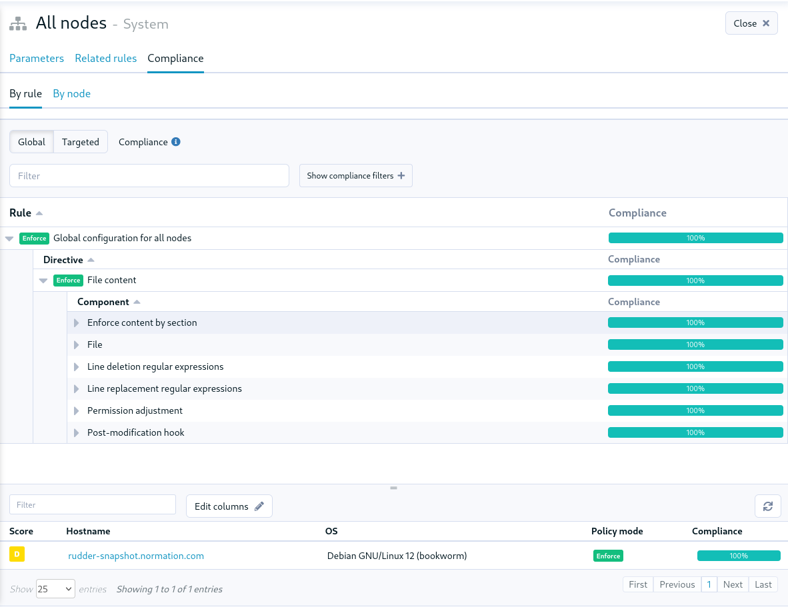

= Rudder 8.1 release notes

We’re thrilled to announce the availability of pre-releases of Rudder 8.1.
The 8.X versions will be mainly dedicated to developing the compliance
axis. This will affect different parts of the application, including the server
and the agent, stay tuned for upcoming features!

== Compliance

=== 📊 Rudder score

image::images/score.png[]

=== Compliance view for groups

== 📗 Policies

=== Policy mode override by method

== Identity and Access Management

=== OIDC-based user provisioning

You can now provision your Rudder users directly with an 
OpenID Connect server.

=== 👥 User sessions

We now store all session history for users in the database.
This information will be exposed in the Web interface in an upcoming
version.

=== Multi-tenant

TODO

== 🛠️ Under the hood

=== New rudder package command

The plugin manager has been rewritten and its command-line interface is now simpler
and more user-friendly.
All commands taking plugin names now accept multiple values.

The new interface is not compatible with the earlier one and the arguments and options
were reworked. For most used commands the changes are:

* `rudder package install-file <file>` -> `rudder package install <file>`
* `rudder package plugin enable/disable <plugin>` -> `rudder package enable/disable <plugin>`
* `rudder package check-connection` -> `rudder package update --check`

You can still use the previous implementation with `RUDDER_PKG_COMPAT=1 rudder package ...`, but it will
be removed in an upcoming release.

=== 🔒 CSP headers

=== Python dep agent

=== ZIO JSON

=== Refactor Rust

=== Preprocesseur CSS SASS

=== Bootstrap 5

=== Syntaxe Windows

== 💾 Installing, upgrading and testing

* Install docs for https://docs.rudder.io/reference/8.1/installation/server/debian.html[Debian/Ubuntu],
https://docs.rudder.io/reference/8.1/installation/server/rhel.html[RHEL/CentOS] and
https://docs.rudder.io/reference/8.1/installation/server/sles.html[SLES]
* https://docs.rudder.io/reference/8.1/installation/upgrade/notes.html[Upgrade nodes and doc]
* https://docs.rudder.io/reference/8.1/installation/versions.html#_versions[Download links]
