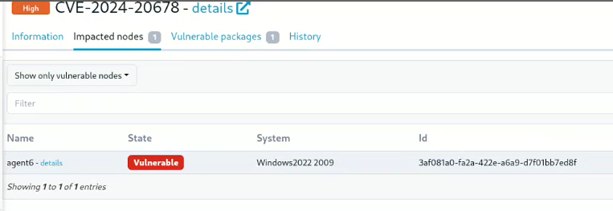

= Rudder 8.2 release notes
:source-highlighter: rouge

We're thrilled to announce the availability of Rudder 8.2.
The 8.X versions are mainly dedicated to developing the compliance
axis, and the 8.2 release is no exception.

== 🛡️ Security benchmarks

Rudder already provided powerful tools to audit and applt security policies, possibly derived from standards like CIS, STIG, etc.

The most important need when applying these kind of policies,
if users want them to be _actually usable_ and not just a theoretical exercise, is the ability to finely configure and tune them
to match the reality of the systems: exceptions, different configurations, etc.
This new feature provides a way to achieve this with minimal effort,
by relying on the powerful data management capabilities of Rudder.

It also allows to provide a dedicated sub-score, independent of general configuration
policies, allowing for a clear overview of the security level of the systems.

== 🔼 Patch & vulnerability management

=== 🪟 Manage Windows system vulnerabilities

The vulnerabilities tracking feature, which previously only supported Linux system,
is now also compatible with Windows. It allows tracking known vulnerabilities in the system,
fixed by available KBs.

=== ⚠️Create groups based on vulnerability presence

The new feature allows creating groups based on the presence of vulnerabilities, directly from the vulnerability entry
in the interface.
The groups are then created as usual, and can be used in policies, reports, etc.
This is useful to apply specific mitigation, plan a targeted upgrade campaign, etc.

=== 🩹 Patch management outcome display

The patch management campaign view now provides a clear outcome of the campaign, with a summary of the number of patches applied, failed, etc.
directly in the campaign view.

=== 🔒 Security-only system update (🐧 on Linux)

The patch campaigns for Linux gained the ability to apply only the security upgrades.
It uses the matching package manager feature depending on the target distribution.

Users now have three options: full system upgrade, security system upgrade, or target upgrade from
a list of packages.

== 📊 Manage workstations and embedded systems with compliance persistence

Rudder is built around a continuous feedback from the agents to the server.
This allows displating real-time data.
But this behavior does not match some use cases where machines can b unable to communication with the server continuously for different reasons: desktop/laptops, which are shut during the night,
embedded systems with inconsistent connectivity, etc.
Currently, they will appear as unavailable "gray nodes", and lower the global compliance (for bad reasons).

For these cases, it will now be possible to keep the latest received data and use it in current graphs.
This is a kind of "No news is good news" mode, with a configurable threshold.

== 👥 The user management interface is now a core feature

The interface for user management previously provided as part of a plugin
is now part of the main application. It was also notably enhanced with a new list view matching other pages' style.

== Under the hood

=== Local account hashes are now configurable by user

This will allow users still having deprecated hashes
to gradually migrate to **bcrypt**, the modern password hash
available in Rudder.

=== ⚙️Introducing the node modules

Module system update.
Previously in Rust
A whole new concept for agent extensibility. Continue Rustification.
Two big focus: logging and reliability

=== 📜 New Windows variable evaluation context

Previously, Powershell. Now Rudder-specific. Prevents code injection in variables.

=== Continue frontend hardening with strict CSP headers

In the same vein as the previous releases, the frontend is now more secure thanks to the use of struct Content Security Policy headers in more pages.

=== Search API for properties

It is now possible to find via the quick search engine, or in a dedicated UI or API, the places where a property (global, group or node) is used.

=== Removal of the old `rudder package` implementation

The old Python-based implementation was deprecated in 8.1, and is now completely removed.

== 💾 Installing, upgrading and testing

* Install docs for https://docs.rudder.io/reference/8.2/installation/server/debian.html[Debian/Ubuntu],
https://docs.rudder.io/reference/8.2/installation/server/rhel.html[RHEL/CentOS] and
https://docs.rudder.io/reference/8.2/installation/server/sles.html[SLES]
* https://docs.rudder.io/reference/8.2/installation/upgrade/notes.html[Upgrade nodes and doc]
* https://docs.rudder.io/reference/8.2/installation/versions.html#_versions[Download links]
