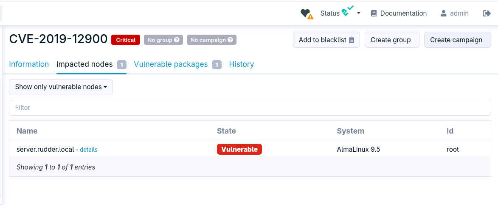
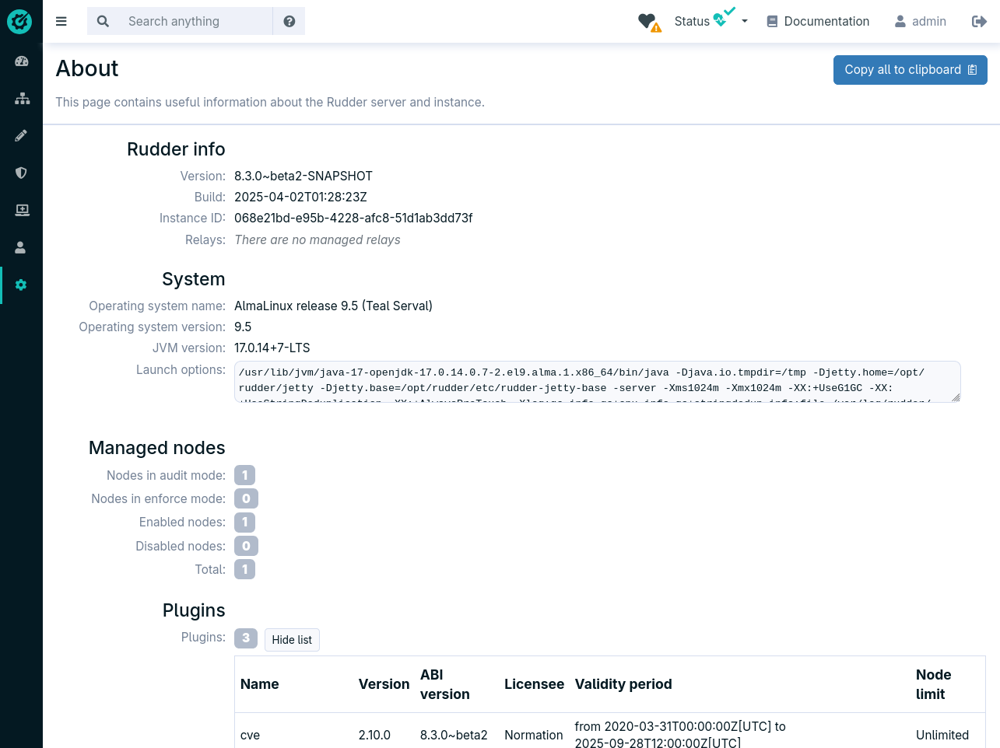

= Change logs for Rudder 8.3

Rudder 8.3 is currently in release candidate stage.
You can test it using development builds, but not use it in production.

It focuses on polishing and consolidating
the features introduced in Rudder 8.

== A new main menu layout

We redesigned the organization of the main menu to make it more intuitive and user-friendly.
It better represents the set of features that Rudder provides, with the benchmarks and patches and vulnerabilities feature sets in their own section
We also added new dedicated sections
for all user and access management, improved settings page with tabs.

== A plugins management interface

Until now, the `rudder package` CLI allowed managing additional features on the Rudder server,
including the subscription features.

With this new version, it is now achievable directly from the Web interface. After a Rudder server is installed, you can
configure your Rudder account, list the plugins available depending
on your chosen subscription, and install the desired plugins in one click.

The interface allows enabling, disabling, upgrading and removing plugin, i.e., all that was possible with the `rudder package` CLI.

== Preparation for a wide range of security benchmarks implementations

The latest major feature of Rudder, the built-in integration of security benchmarks is making progress, and we are getting ready to provide
turn-key fully configurable benchmarks for industry standards (like CIS).
They are ready to be distributed as standard Rudder plugins.

They integrate powerful customization features, targeted application by node groups,
and detailed score-based results.

More information coming soon!

== Direct remediation campaigns for vulnerabilities

Rudder has detected a vulnerability affecting some of your nodes based on the installed package list.

In one click, you can create a patch campaign to remediate the vulnerability, automatically
selecting the right nodes and target packages.

You only need to set the schedule (e.g. deploy the fix this night between 1 and 4 a.m.)

== Vulnerabilities ignore list

When a vulnerability affects some of your nodes, based on the list of installed packages, it
you may have a different evaluation of the vulnerability than the one provided by the vulnerability database.

In some cases, the way you use the affected package or the way the vulnerability is exploited
may not apply to your environment. In this case, it is now possible to ignore the vulnerability
altogether.

This makes your vulnerability score more relevant to your environment, and prevents false positives.

== API accounts can now be authenticated using OAuth 2.0

== A new **About** page

Provides information about the Rudder instance, and an export button
to facilitate the sharing of this information with the Rudder support team.

== Rudder agent support for Windows Server 2025

Windows Server 2025 is now supported by the Rudder agent.

== Loops in techniques

The techniques can now include loops. Iterations can be made at the method or block level.
This allows reusing technique parts with different parameters.
The iterations are done on a list of key-value sets, allowing,
for example, to iterate over a list of package names and versions.

This new feature is compatible with both the Linux and Windows agents.

== A new method for file audits and editions

A new agent extension, exposed as a new method, is added for file editions and audits. It is based
on the Augeas library, which is a powerful tool for parsing and editing configuration files.
We added support for advanced file audits, including the ability to
check for values in a set, between two values, within an IP range, etc.

A special attention was given to the quality of the error messages, to help
understand the non-compliances directly from the Web interface, with as
much context as possible.

== New RPM signing key

We are now using the same key used for other artifacts (plugins, DPKG packages) to sign our RPM packages.
The previous key was only 1024 bits long and needed to be replaced.
The installation and upgrade documentation explains how to import the new key.

== 💾 Installing, upgrading and testing

* Install docs for https://docs.rudder.io/reference/8.3/installation/server/debian.html[Debian/Ubuntu],
https://docs.rudder.io/reference/8.3/installation/server/rhel.html[RHEL/CentOS] and
https://docs.rudder.io/reference/8.3/installation/server/sles.html[SLES]
* https://docs.rudder.io/reference/8.3/installation/upgrade/notes.html[Upgrade nodes and doc]
* https://docs.rudder.io/reference/8.3/installation/versions.html#_versions[Download links]
