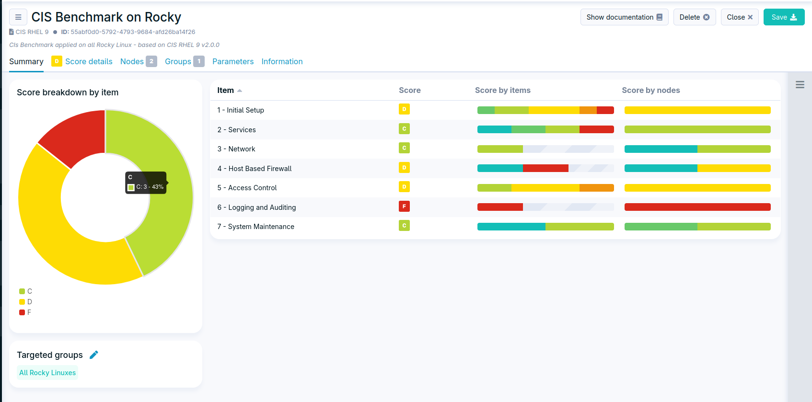
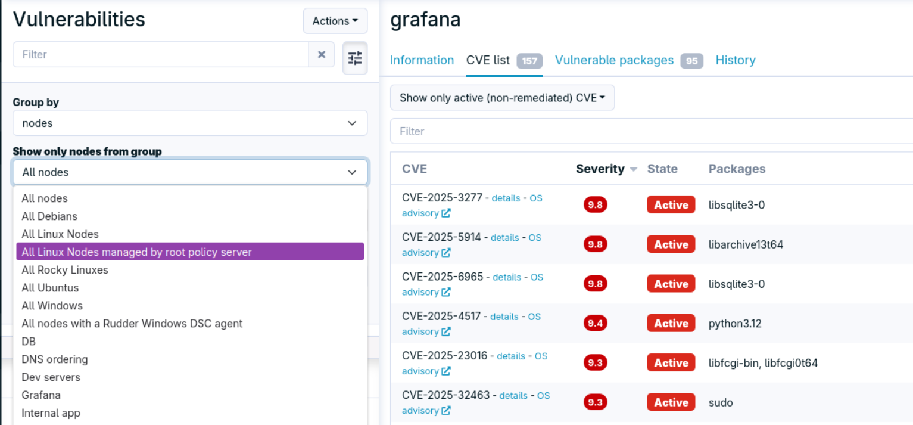
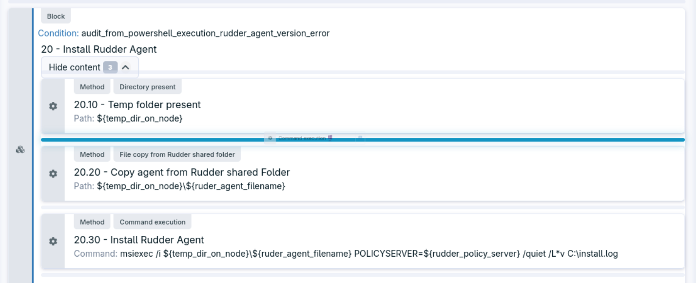
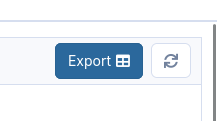

= Change logs for Rudder 9.0

== New operating systems supported

*Debian 13* and *Red Hat Enterprise Linux/Rocky/AlmaLinux/Oracle Linux 10* are now fully supported by Rudder 9.0, both as server and agent OS.

== Security benchmarks

The security benchmarks feature is officially out of beta,
and comes with many improvements over the 8.3 version.
They include a new visualization interface by benchmark, and a
detailed view by item or by nodes.

== CVE by group

The vulnerability management interface now allows filtering by group,
making it easier to get an overview of the risk by categories of nodes.

== Patch campaign hooks

It was already possible to run actions locally on the nodes before and after the
upgrades. We added an https://github.com/Normation/rudder/blob/branches/rudder/9.0/webapp/sources/rudder/rudder-core/src/main/resources/hooks.d/campaigns/readme.adoc[additional mechanism], on the server side, with action
running globally for each patch management event.
It is possible to trigger actions before the start of an event or after it finished.

== Technique editor

The interface was improved with a redesigned drag-and-drop behavior and other
quality of life improvements.

== CSV export for tables

We added CSV export to several tables in the interface, allowing easy reuse of
Rudder data in other contexts (in addition to the HTTP API).

== [_Technical preview_] HTTPS communication

It is now possible to use HTTPS for policy download on Linux. It allows disabling the
custom protocol (by default on port 5309) and to only use HTTPS for all communications.

When in HTTPS-only mode, a few features are disabled:

* Remote run on Linux agents
* Recursive file copies from the server
* Relays require the rsync synchronization mode

This mode will become the default once the remaining limitations are lifted.

== [_Technical preview_] Certificate validation

When in HTTPS-only mode, it is possible to switch all HTTPS communications
to use standard certificate validation instead of the default
pinning-based mode.
It requires managing the HTTPS certificates with a user-managed PKI.
The certificate authorities can be specific to Rudder or system-wide.

== Improved template management

We introduced a versatile templating method, based on a multi-platform
module running on both Linux and Windows agents. It allows
using the existing template engines, mustache and jinja2, plus
a new option, minijinja, which provides most jinja2 features with
a fast native implementation, without external dependencies.

This method also allows passing a JSON object as data for the
template, as an alternative to the global agent context.

It also improves reporting, with a diff-like display of changes
and non-compliances.

== Agent can run with `/var` mounted with `noexec`

It is now possible to run Linux agents on systems where the
`/var` partition is mounted with the `noexec` options,
as recommended by several hardening guides.

== Safer local passwords

The default hash algorithm is now *argon2id*, and *bcrypt* is still supported.
Deprecated unsafe algorithms support is dropped.

== Under the hood

* The strict `Content-Security-Policy` header configuration is now enabled everywhere.
* The backend code base was migrated to Scala 3 (from 2.13 to 3.7).
* The `relayd` daemon, written in Rust, was updated to the `hyper` 1.0 stack.
* All Linux methods were migrated to a new reporting implementation based on stable unique identifiers, which will make UX improvements possible in future versions.

== 💾 Installing, upgrading and testing

* Install docs for https://docs.rudder.io/reference/9.0/installation/server/debian.html[Debian/Ubuntu],
https://docs.rudder.io/reference/9.0/installation/server/rhel.html[RHEL/CentOS] and
https://docs.rudder.io/reference/9.0/installation/server/sles.html[SLES]
* https://docs.rudder.io/reference/9.0/installation/upgrade/notes.html[Upgrade nodes and doc]
* https://docs.rudder.io/reference/9.0/installation/versions.html#_versions[Download links]
