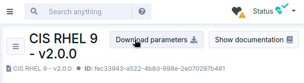
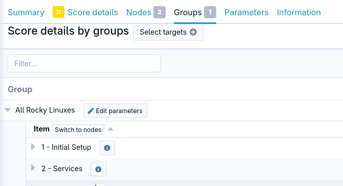
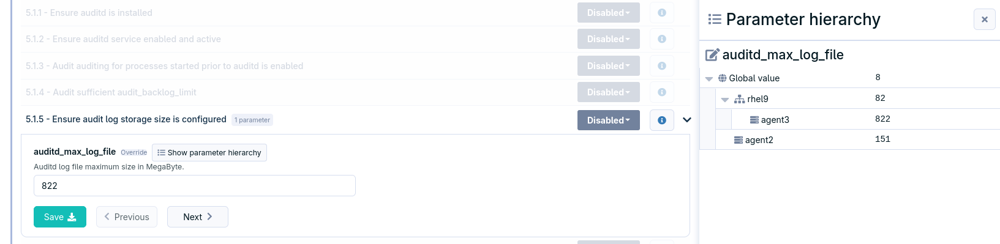
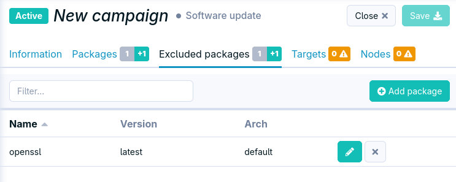
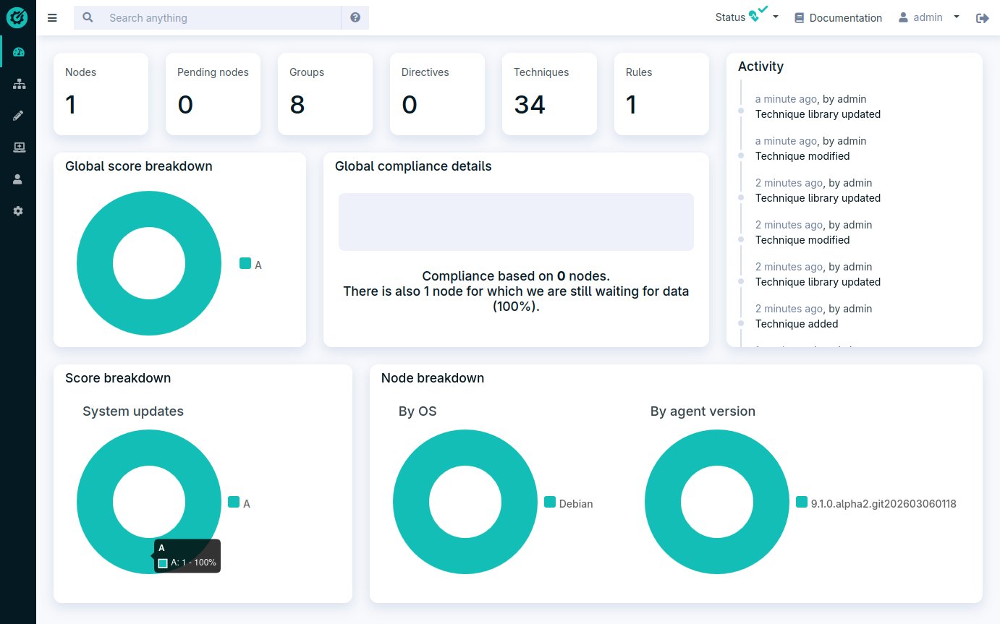
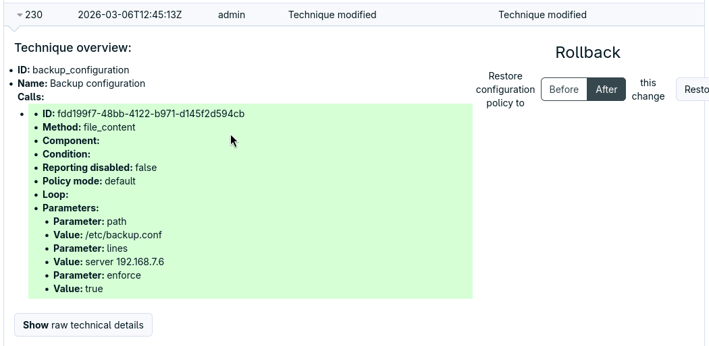
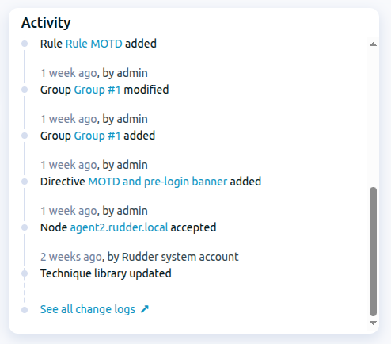

= Change logs for Rudder 9.1

Rudder 9.1 is currently the development version of Rudder.
You can test it using development builds, but not use it in production.

After adding a new major feature in 9.0, security benchmarks, the 9.1 releases focuses on
improving the existing features, and consolidating the foundations of Rudder,
with various UX and quality of life improvements.

== Security benchmarks

* It is now possible to export a benchmarks's configuration as a CSV, including the state of each component (audit, enforce, disabled) and the values of the parameters.

* A new view is introduced to show the benchmarks results by group.

* The configuration excetions hierarchy is now visible.

== Patch management

* It is possible to exclude specific packages/KBs from a patch management campaign
  allowing more precise upgrades.

* The "Security-only" system campaigns are now usable on Windows systems too.

* The available updates can be be viewed by group (like it was already possible with vulnerabilities)

== Dashboard refresh

The dashboard content was refreshed, with a focus on relevant scores.

== Traceability

=== More CSV exports

More tables incluse a button to expore the content as CSV,
allowing easier communication with other stakeholders:

* Rules
* Groups
* Patch management campaign results by node

=== Improved change logs

The change logs now filter out the internal events, showing only relevant user actions.
The technique changes are also now included.

=== Activity on the dashboard

=== Last token usage

The API tokens table now show that latest usage date of the tokens,
allowing to easily spot unused tokens.

== New operating systems

Support was added for agent, relay and server, on:

* SLES 16, without SELinux support for now.
* Ubuntu 26.04 LTS (to be released)

== MSI signature

Our MSI installer for the Windows agent is now signed with a recognized (DigiCert) certificate.
This makes the installation simpler.

== Under the hood

* A new `secedit` module and method allowing to configure some security settings of Windows. This prepares the ground for the upcoming security bnchmarks for Windows.
* Upgrade to Jetty 12
* A CSS graphic charter
* A new Elm library to help factorize the tables of the interface
* The patch management implementation on Windows now uses the same module as Linux
* The CI platform was enhaunced, with more tests on Windows, added tests on ARM platform

== 💾 Installing, upgrading and testing

* Install docs for https://docs.rudder.io/reference/9.1/installation/server/debian.html[Debian/Ubuntu],
https://docs.rudder.io/reference/9.1/installation/server/rhel.html[RHEL/CentOS] and
https://docs.rudder.io/reference/9.1/installation/server/sles.html[SLES]
* https://docs.rudder.io/reference/9.1/installation/upgrade/notes.html[Upgrade nodes and doc]
* https://docs.rudder.io/reference/9.1/installation/versions.html#_versions[Download links]

