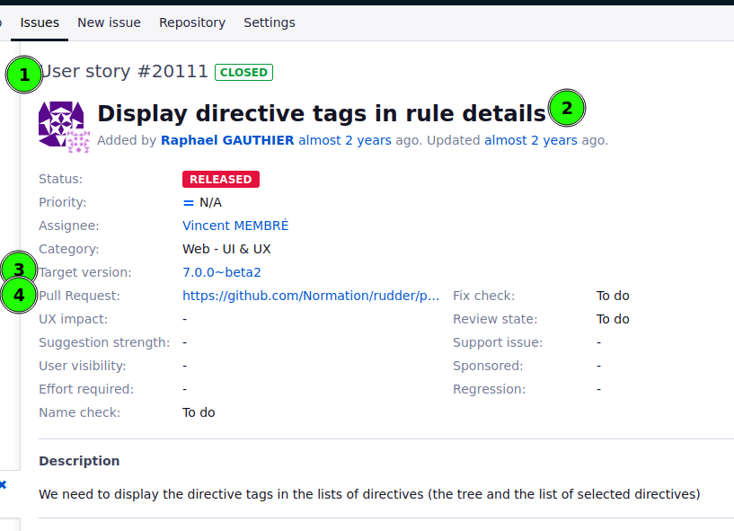

# rudder-dev

`rudder-dev` is our internal tool that manages the boilerpate around our convention for addressing an issue, making a PR in the correct branch, and general interactions between [`issues.rudder.io`](http://issues.rudder.io) and `github.com/normation`.

The tools is part of `rudder-tools` repository and sources can be found at: [https://github.com/Normation/rudder-tools/tree/master/scripts/rudder-dev](https://github.com/Normation/rudder-tools/tree/master/scripts/rudder-dev) 

# Install

`rudder-dev` is a python 3 script. It’s published in our repository. 

Quick install (assuming a Linux distro and `/usr/local/bin` being in path):

```scala
curl https://repository.rudder.io/tools/rudder-dev > /usr/local/bin/rudder-dev && chmod +x /usr/local/bin/rudder-dev
```

The tools needs following dependencies: 

- **requests**: `pip install requests` or typically named `python-requests` in your distro package manager
- **docopt**: `pip install docopt` or typically named `python-docopt` in your distro package manager
- **dateutil:** `pip install python-dateutil` or typically named `python3-datetutil` in your distro package manager
- **pylint:** `pip install pylint` or typically named `pylint` in your distro package manager (beware of old python 2 versions)
- **dateutil:** `pip install python-dateutil` or typically named `python3-datetutil` in your distro package manager
- **shellcheck:** typically named `ShellCheck` in your distro package managers

# Configuration

`rudder-dev` needs a configuration files where `github` information are stored. 

## Path

The configuration file is located at `~/.rudder-dev`.

## Naming convention for rudder remote origin and your clone remote origin

Rudder use github pull request system to contribute code. So you will always have to deal with the remote reposioty and your github clone of it for each Rudder related repository.

`rudder-dev` needs that you follow the same naming convention for `origin` (ie remote name for git) for each of them respectively on each.

For example, François always use: 

- `origin` for the corporate (`normation`) repository
- `${gitUserName}_origin` for the clone for that person (included his own).

```bash
# .git/config for rudder repository
[remote "origin"]
        fetch = +refs/heads/*:refs/remotes/origin/*
        url = git@github.com:Normation/rudder.git
        fetch = +refs/pull/*/head:refs/remotes/origin/pr/*
[remote "fanf_origin"]
        url = git@github.com:fanf/rudder.git
        fetch = +refs/heads/*:refs/remotes/fanf_origin/*
        fetch = +refs/pull/*/head:refs/remotes/fanf_origin/pr/*
```

## Init & config

An empty template is created for you the first time `rudder-dev` is run. So run the tool one time, and complete the generated template. 

You will need: 

- a github account with your (a) personnal API token from [https://github.com/settings/tokens/new](https://github.com/settings/tokens/new)
- a Rudder bugtracker account from [https://issues.rudder.io](https://issues.rudder.io) and corresponding API token from [https://issues.rudder.io/my/account](https://issues.rudder.io/my/account) (manage in the left part of the page)
- optionnaly, the `hub` command

Parameters should be commented enought to be explicit. 

# Usage

`rudder-dev --help` gives you a complete view of the usage of the tool. The main use cases are explained below. 

## Take ownership of an issue and work on it

### Existing issue set-up

In Rudder, we mandate that any code change is tracked by an issue, see [Règles de contribution et de trace des modifications (commit) du code de Rudder](https://www.notion.so/R-gles-de-contribution-et-de-trace-des-modifications-commit-du-code-de-Rudder-8b08b44a425a4f3e8afa632b8b8aed6b?pvs=21). So the work hyppothesis is that such an issue exists. 



The issue: 

- must have the correct tracker (1) (`user story`, `enhancement`, `bug`, `architecture`) and clear, short title (2). They will be used to generate the name for the local git branch based on template `${tracker prefix}_${issue number}/${lower_case_name_with_underscores}`.
    - In the example: `ust_20111/display_directive_tags_in_rule_details`
- must have the correct target version (3). It will be used to choose the correct github branch from which the working branch will be created, and latter on the base branch for the pull request.

### Create local branch, change status to in-progress

Go to the repository where the code to change is and just do:

```bash
rudder-dev 20111
```

Where `20111` is the ID number of the issue.

This will update your local repository (`git fetch`). Then, it will checkout the branch corresponding to the issue target version, update it (`git pull`), and create a new branch derived from it named accordingly to the template previously explained.

It will also update the bucktracker issue to set the user working on the issue and change the statue to “in progress”.

Now you just have to work on your local branch until you’re happy.

### Commiting a work-in-progress

If at some point you want to share a WIP of your code, use:

```bash
rudder-dev wip
```

It will create a commit on your local branch and push it on your repo, plus update the bugtracker with a link toward the WIP code on github.

### Commiting for review

Once you’re happy with your code and tests, and have run the linter (for ex for scala code: `mvn spotless:apply`), you can commit your code so that a reviewer can review it. 

Use the command: 

```bash
rudder-dev commit [trigram]
```

Where `[trigram]` is the identifier trigram for the reviewer. If you don’t specify `[trigram]`, `rudder-dev` will ask for it interactively. 

Then, `rudder-dev` will:

- create a commit with a commit message with the correct syntax to triger the link with the issue (ie `Fixes #20111: Name of the issue`)
- push it on a remote branch on your own repo,
- create a pull-request and assign it to the reviewer,
- update the issue status to set it to “waiting for review”, changing the actor accordingly,
- update the issue to add the link to the PR

You still have to go to the PR and add an interesting description explaining what are the main change provided by it, what architecture impact it has, or anything that will help the reviewer understand what you did and why like that. 

### Correct your code post-PR

It happens (we know, extremely rarely, but it happens) that you have to provide some changes in your code, and they are somehow minor. In that case, you can just change your code and use: 

```bash
rudder-dev fixup
```

It will create a commit that has the correct syntaxt to be smashed upon merge and push it to your PR. 

## Other usages

Read the help or ask Rudder dev !
